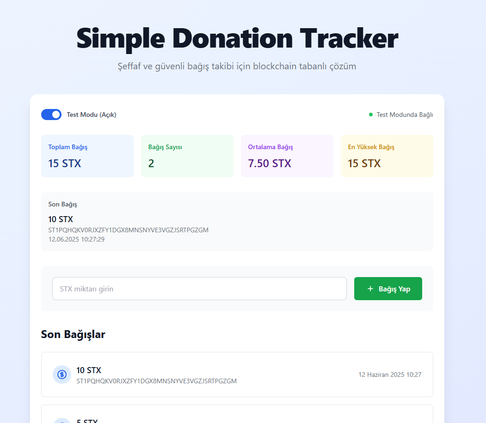

# Simple Donation Tracker on Stacks

## Project Description

Simple Donation Tracker on Stacks is a blockchain-based application that allows users to make STX donations. All donations are transparently stored in a Clarity smart contract, and users can view their donation history through a user-friendly frontend.

## Repository URL

https://github.com/onurcansevinc/simple-donation-tracker-on-stacks

## Technologies Used

-   Stacks Blockchain
-   Clarity Smart Contracts
-   Next.js/React
-   Stacks.js libraries
-   Tailwind CSS

## Key Features

-   **Donation Tracking**: Users can make STX donations and track their donation history.
-   **Transparency**: All donations are stored on the blockchain, ensuring transparency and security.
-   **User-Friendly Interface**: A responsive frontend built with Next.js and React for easy interaction.
-   **Real-Time Notifications**: Users receive notifications for new donations and donation confirmations.

## Smart Contracts

-   **donation-tracker.clar**: Manages the donation logic, including adding and retrieving donations.

## Getting Started

### Prerequisites

-   Node.js (v14 or later)
-   npm or yarn
-   Stacks wallet (Hiro Wallet, Xverse)

### Installation

1. Clone the repository:

    ```bash
    git clone [your-repo-url]
    cd simple-donation-tracker-on-stacks
    ```

2. Install dependencies:

    ```bash
    cd frontend
    npm install
    ```

3. Start the development server:
    ```bash
    npm run dev
    ```

## Usage

1. Connect your Stacks wallet using the "Connect Wallet" button.
2. Enter the amount of STX you wish to donate.
3. Submit the donation and wait for confirmation.
4. View your donation history on the dashboard.

## Smart Contract Documentation

### Functions

-   **add-donation**: Adds a new donation to the contract.

    -   Parameters:
        -   `amount`: The amount of STX to donate.
        -   `sender`: The address of the sender.

-   **get-all-donations**: Retrieves all donations.

    -   Returns: A list of all donations.

-   **get-donation**: Retrieves a specific donation by ID.
    -   Parameters:
        -   `id`: The ID of the donation to retrieve.

## Deployment

### Testnet

1. Deploy the smart contract to the Stacks testnet using the provided deployment scripts.
2. Update the frontend configuration to point to the testnet.

### Mainnet

1. Deploy the smart contract to the Stacks mainnet using the provided deployment scripts.
2. Update the frontend configuration to point to the mainnet.

## Testing

Run the tests for the smart contracts:

```bash
cd contracts
npm test
```

## Contributing

Contributions are welcome! Please open an issue or submit a pull request.

## License

This project is licensed under the MIT License.

## Contact/Support

For support, please open an issue in the GitHub repository.

## Acknowledgments

Thanks to the Stacks ecosystem for providing the tools and resources to build this project.

## Screenshots




